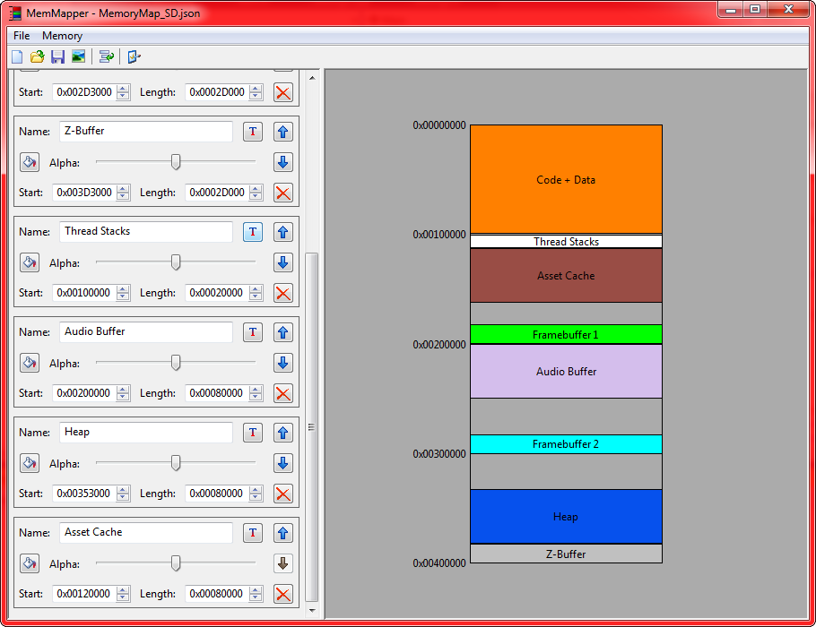

# MemMapper

A cross-platform application for making visuals of Memory Maps.

### Compilation

If you are on Windows, ensure you have wxWidgets installed (instructions available [here](https://docs.wxwidgets.org/trunk/plat_msw_install.html)), and a copy of Visual Studio 2019 with [Platform Toolset v140_xp](https://stackoverflow.com/questions/58755564/visual-studio-2019-how-to-use-platform-toolset-v140-xp/58755565#58755565) installed. If all of that is set up, then simply open the solution file in Visual Studio and compile. 

Linux instructions will be added soon.

### Credits

This application uses [wxWidgets](https://www.wxwidgets.org/) in order to make the GUI application cross-platform.

This program uses [JSON for Modern C++](https://github.com/nlohmann/json) for saving and loading memory maps.